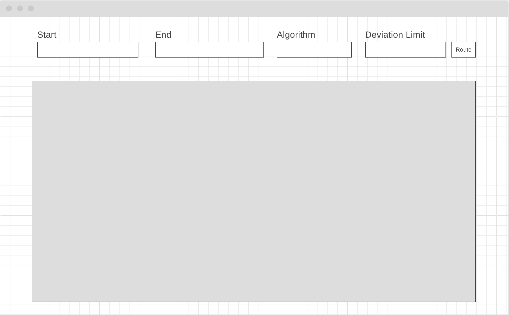
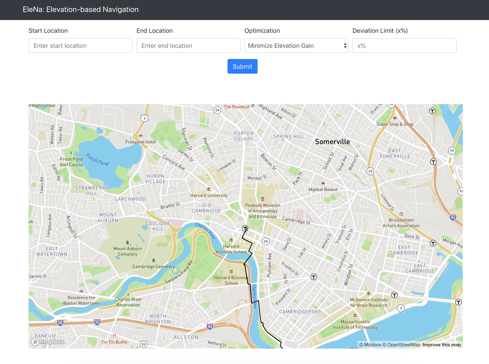
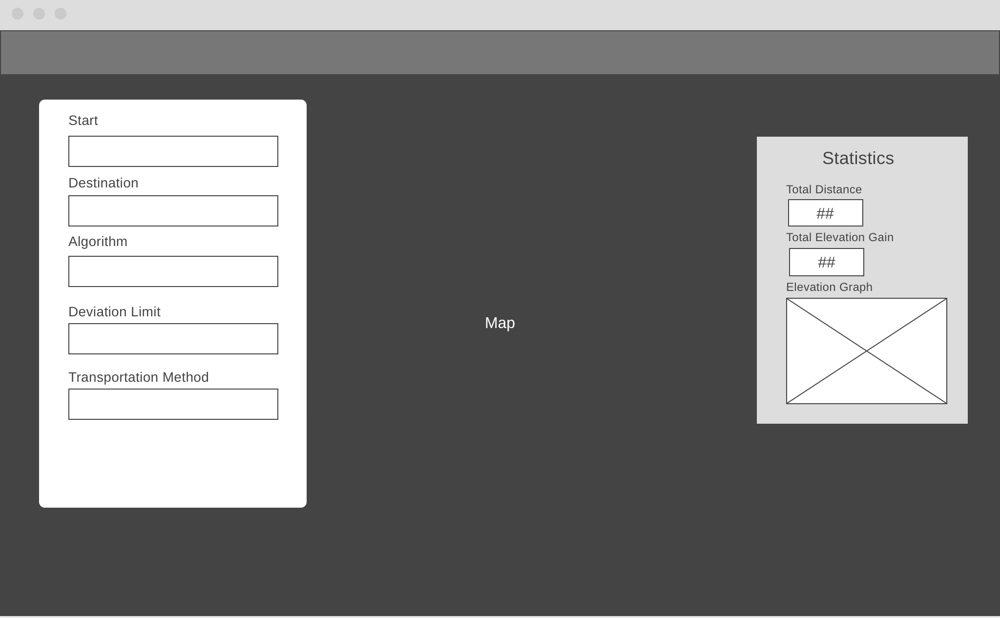
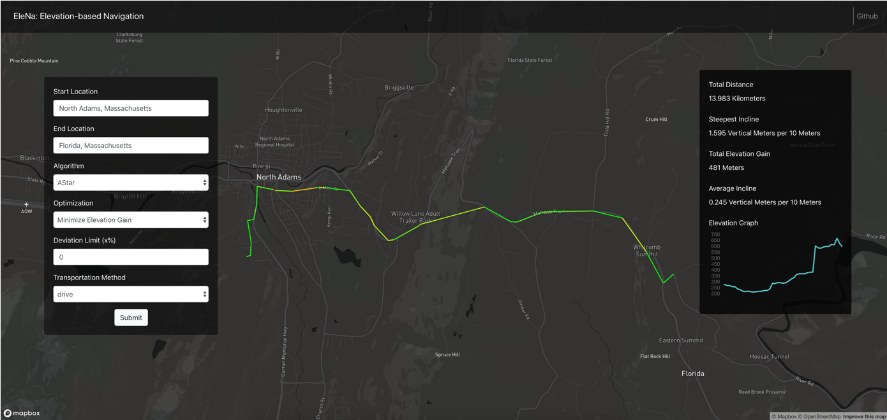

## UI Implementation Process

### First Iteration

Wireframe           |  Implementation
:-------------------------:|:-------------------------:
 |  

The first iteration of our UI suited the needs of our system, as it had all the inputs needed for our algorithms. However this design iteration lacked space to cleanly display statistics about the route and provide additional information to the user. The need for a redesign became clear during our testing phase, where we realized that we wanted more information to be displayed to the user about their route.

### Second Iteration

Wireframe           |  Implementation
:-------------------------:|:-------------------------:
 |  

In our second iteration, we finalized a more modern design, by placing the user input and statistics above the map. We also chose a dark theme for our layout, and added in route colors that would display the steepness of your route along the way. This implementation became the final choice for the UI.